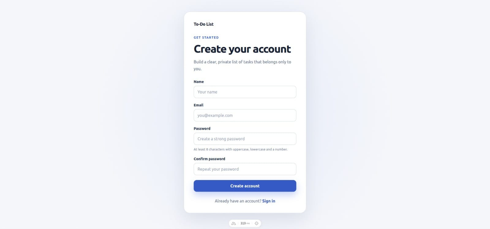
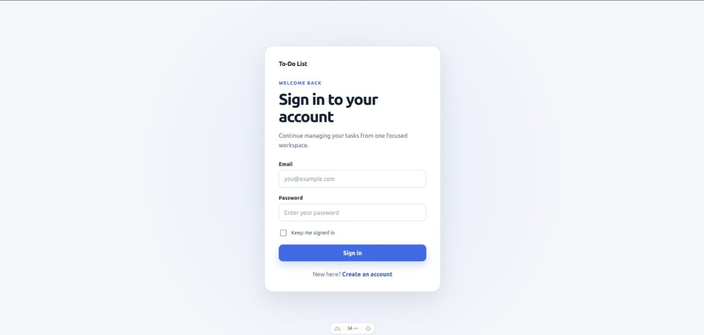
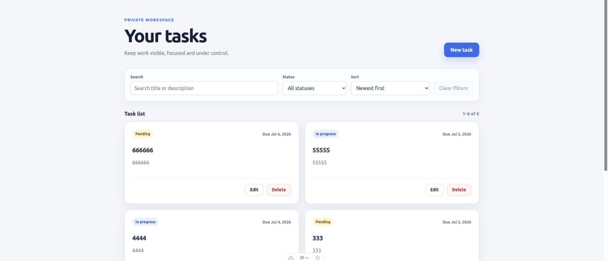
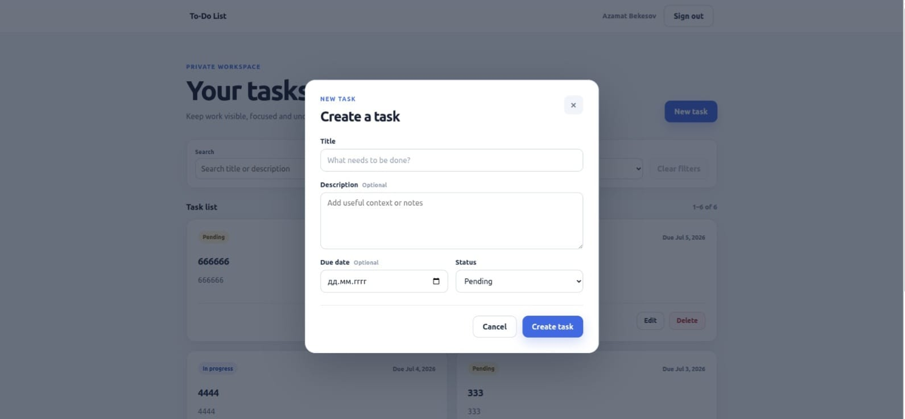
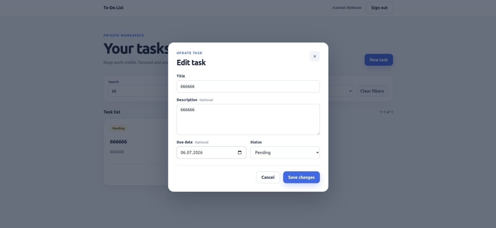
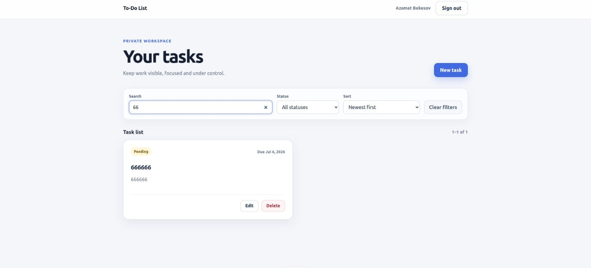
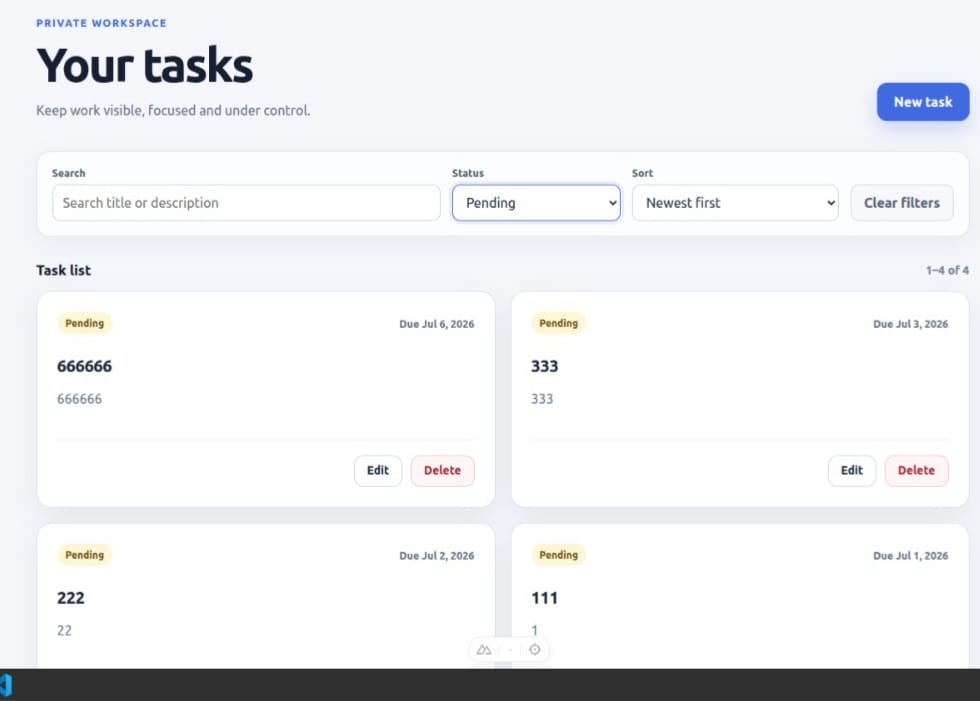
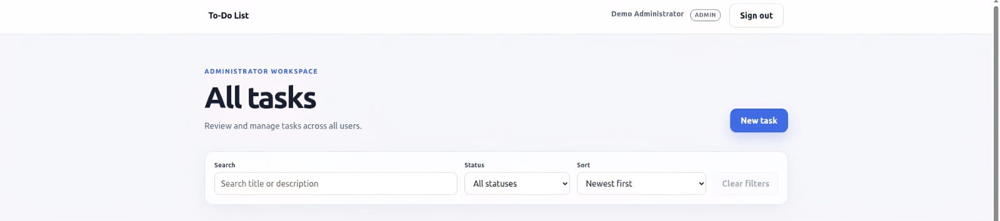
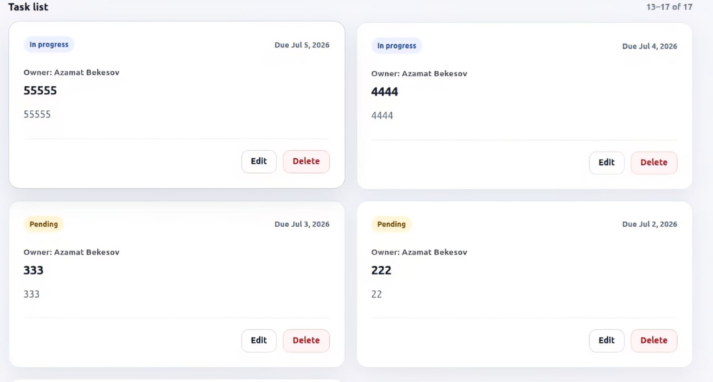
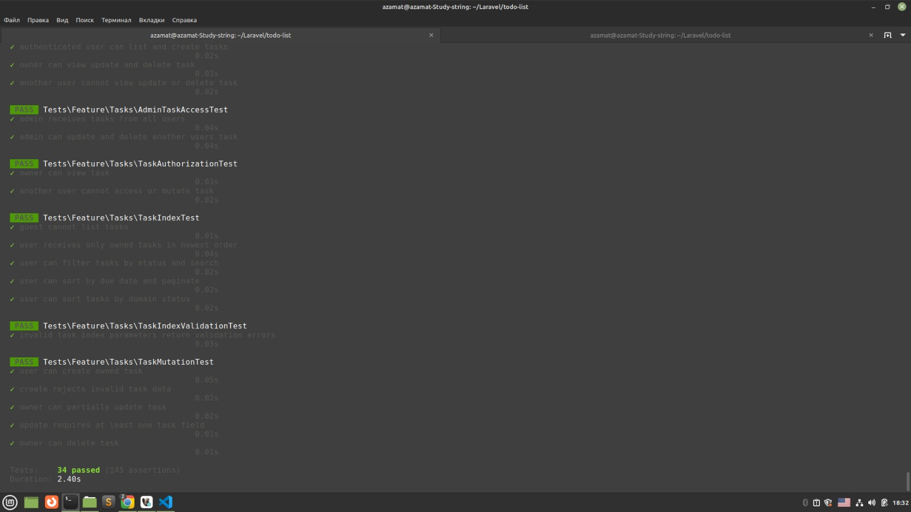

# ✅ To-Do List


**To-Do List** — полнофункциональное **SPA-приложение** для управления задачами на базе **Laravel REST API** и **Nuxt 4**.

Пользователи могут регистрироваться, входить в систему, создавать и управлять личными задачами, искать, фильтровать и сортировать их, а также сохранять состояние Dashboard в URL.

Дополнительно реализована **ролевая модель `admin/user`**: обычный пользователь работает только со своими задачами, а администратор видит задачи всех пользователей, владельцев задач и может управлять общим списком.

> Проект реализован как тестовое задание с акцентом на **безопасность доступа**, **понятное разделение ответственности**, **проверяемость поведения**, **предсказуемый API-контракт** и **качество кода без избыточного усложнения архитектуры**.

---

## 📋 Содержание

- [Описание проекта](#-описание-проекта)
- [Основные возможности](#-основные-возможности)
- [Скриншоты](#️-скриншоты)
- [Стек технологий](#-стек-технологий)
- [Архитектура](#-архитектура)
- [Аутентификация](#-аутентификация)
- [Роли и контроль доступа](#-роли-и-контроль-доступа)
- [Модель данных](#-модель-данных)
- [REST API](#-rest-api)
- [Фильтрация, поиск и сортировка](#-фильтрация-поиск-и-сортировка)
- [Валидация](#-валидация)
- [Обработка ошибок](#️-обработка-ошибок)
- [Frontend](#-frontend)
- [Надёжность и безопасность](#-надёжность-и-безопасность)
- [Demo-данные](#-demo-данные)
- [Тесты](#-тесты)
- [Статический анализ и качество кода](#-статический-анализ-и-качество-кода)
- [Docker-окружение](#-docker-окружение)
- [Локальный запуск](#-локальный-запуск)
- [Полезные команды](#-полезные-команды)
- [Структура проекта](#-структура-проекта)
- [Что было дополнительно усилено](#-что-было-дополнительно-усилено)
- [Архитектурные решения](#-архитектурные-решения)
- [Возможные улучшения](#-возможные-улучшения)
- [Финальный статус проекта](#-финальный-статус-проекта)

---

## 📖 Описание проекта

Приложение состоит из двух независимых частей:

```text
Nuxt SPA
   ↓ HTTP / JSON / Cookies
Laravel REST API
   ↓
SQLite
```

### Backend

Laravel отвечает за:

- регистрацию и аутентификацию;
- управление сессиями и CSRF-защиту;
- REST API задач;
- валидацию запросов;
- фильтрацию, поиск, сортировку и пагинацию;
- контроль доступа и ролевую модель;
- формирование стабильных JSON-ответов.

### Frontend

Nuxt отвечает за:

- страницы регистрации и входа;
- хранение состояния текущего пользователя;
- Dashboard с поиском, фильтрацией, сортировкой и пагинацией;
- обработку loading / error / empty состояний;
- автоматическую реакцию на завершение сессии;
- синхронизацию фильтров и страницы с URL.

---

## ✨ Основные возможности

### Пользовательские возможности

- регистрация, вход и безопасный выход;
- восстановление сессии после перезагрузки;
- создание, редактирование и удаление задач;
- выбор статуса и установка срока выполнения;
- поиск по названию и описанию;
- фильтрация по статусу;
- сортировка по дате создания, дедлайну, статусу и названию;
- серверная пагинация;
- **сохранение фильтров и страницы в URL** — восстанавливается после `F5`.

### Административные возможности

- роль `admin`;
- просмотр задач **всех пользователей** с отображением владельца;
- редактирование и удаление **чужих задач**;
- отдельное визуальное состояние Dashboard с badge администратора;
- **серверный контроль** всех административных операций.

### Технические возможности

- **Sanctum stateful SPA authentication**;
- REST API + Policies + Form Requests + API Resources;
- **PHP enums** для ролей и статусов;
- `TaskQuery` для сложной фильтрации, `TaskService` для мутаций;
- JSON-ответы для ошибок авторизации;
- **CORS с поддержкой credentials**;
- **debounce** поиска + защита от race condition;
- повторяемый demo-seeder;
- backend и frontend тесты;
- **PHPStan level 7**, Laravel Pint, ESLint, TypeScript;
- Composer и npm security audit.

---

## 🖼️ Скриншоты

### Регистрация

SPA-страница регистрации с клиентской и серверной валидацией.



---

### Вход

Вход через **Laravel Sanctum cookie-session authentication**. Пароль и данные сессии не хранятся в `localStorage`.



---

### Пользовательский Dashboard

Обычный пользователь видит **только собственные задачи**. Доступны создание, редактирование, удаление, поиск, фильтрация, сортировка и пагинация.



---

### Создание задачи

Создание задачи через **модальное окно** без перехода на отдельную страницу.



---

### Редактирование задачи

Форма редактирования переиспользует тот же компонент, что и создание задачи.



---

### Поиск и сортировка

Поиск выполняется по названию и описанию с **debounce** — API-запрос не отправляется при каждом символе.



---

### Сортировка по статусу

Поддерживается доменная последовательность статусов:

```text
pending → in_progress → completed
```

и обратный порядок.



---

### Административный Dashboard

Администратор видит задачи **всех пользователей** и общий размер выборки.



---

### Владельцы задач

В административном режиме на каждой карточке отображается **владелец задачи**. Для обычного пользователя эта информация скрыта.



---

### Тесты и проверки качества

Backend и frontend имеют отдельные автоматические quality gates.



---

## 🛠 Стек технологий

### Backend

| Технология | Назначение |
|---|---|
| **PHP 8.4** | Runtime |
| **Laravel 13.19** | Backend framework |
| **Laravel Sanctum 4** | Stateful SPA authentication |
| **SQLite** | Основная база данных |
| **Eloquent ORM** | Работа с моделями и связями |
| **Form Requests** | Валидация и нормализация запросов |
| **API Resources** | Формирование JSON-контрактов |
| **Laravel Policies** | Авторизация действий |
| **PHP Enums** | Роли и статусы задач |
| **PHPUnit** | Feature и model тесты |
| **Laravel Pint** | Code style |
| **Larastan / PHPStan** | Статический анализ — level 7 |
| **Composer Audit** | Проверка PHP-зависимостей |

### Frontend

| Технология | Назначение |
|---|---|
| **Nuxt 4.4** | Frontend framework |
| **Vue 3.5** | UI |
| **Composition API** | Организация компонентной логики |
| **TypeScript** | Типизация |
| **Pinia** | Состояние аутентификации |
| **ofetch** | HTTP-клиент |
| **Nuxt Route Middleware** | Защита страниц |
| **Vitest** | Frontend-тесты |
| **Vue Test Utils** | Тестирование компонентов |
| **ESLint** | Code style и статический анализ |
| **Nuxt Typecheck** | Проверка TypeScript |
| **npm Audit** | Проверка JS-зависимостей |

### Инфраструктура

| Технология | Назначение |
|---|---|
| **Docker** | Изолированное окружение |
| **Docker Compose** | Запуск backend и frontend |
| **Git / GitHub** | Контроль версий и доставка проекта |

---

## 🏗 Архитектура

```text
HTTP Request
    ↓
FormRequest
    ↓
Controller
    ↓
Query / Service
    ↓
Policy
    ↓
Eloquent Model
    ↓
Database
    ↓
API Resource
    ↓
JSON Response
```

### Backend-слои

| Слой | Ответственность |
|---|---|
| `Controller` | Координация HTTP-запроса и ответа |
| `FormRequest` | Подготовка, нормализация и валидация |
| `TaskQuery` | Поиск, фильтрация, сортировка, pagination |
| `TaskService` | Создание, обновление и удаление задач |
| `Policy` | Проверка прав доступа |
| `Model` | Состояние сущностей и связи |
| `Resource` | Стабильный JSON-контракт |
| `Enum` | Допустимые роли и статусы |

### Frontend-слои

```text
Page
  ↓
Components
  ↓
Pinia / Local reactive state
  ↓
Nuxt API plugin
  ↓
Laravel API
```

**Pinia используется только для глобального состояния аутентификации.** Состояние задач, форм, фильтров и пагинации остаётся внутри Dashboard — оно не нужно другим страницам.

---

## 🔐 Аутентификация

Аутентификация построена на **Laravel Sanctum в режиме stateful SPA**.

### Процесс входа

```text
1. GET /sanctum/csrf-cookie
2. Laravel устанавливает XSRF-TOKEN и session cookie
3. POST /api/auth/login
4. Laravel проверяет credentials
5. Session ID регенерируется
6. Frontend сохраняет текущего пользователя в Pinia
7. Последующие запросы отправляются с credentials: include
```

### Процесс выхода

```text
1. GET /sanctum/csrf-cookie
2. POST /api/auth/logout
3. Laravel завершает authentication guard
4. Session инвалидируется + CSRF token регенерируется
5. Frontend очищает auth state → редирект на /login
```

### Восстановление сессии

При открытии приложения frontend выполняет:

```http
GET /api/user
```

| Ответ | Значение |
|---|---|
| `200 OK` | Пользователь авторизован |
| `401 Unauthorized` | Пользователь является гостем |

### Истёкшая сессия

Nuxt API plugin глобально перехватывает `401` на защищённых маршрутах:

- очищается Pinia auth state;
- пользователь перенаправляется на `/login`;
- старое состояние Dashboard не остаётся активным;
- **бесконечного цикла запросов не возникает**.

> Проект не использует bearer tokens, personal access tokens или `localStorage` для хранения данных сессии. Для браузерного SPA применяется стандартная защищённая **cookie-session модель Sanctum**.

---

## 👥 Роли и контроль доступа

Поддерживаются две роли:

```php
enum UserRole: string
{
    case Admin = 'admin';
    case User  = 'user';
}
```

### Матрица доступа

| Возможность | User | Admin |
|---|:---:|:---:|
| Смотреть свои задачи | ✅ | ✅ |
| Смотреть чужие задачи | ❌ | ✅ |
| Создавать задачи | ✅ | ✅ |
| Редактировать свои задачи | ✅ | ✅ |
| Редактировать чужие задачи | ❌ | ✅ |
| Удалять свои задачи | ✅ | ✅ |
| Удалять чужие задачи | ❌ | ✅ |
| Видеть владельца задачи | ❌ | ✅ |

### Laravel Policy

Для обычного пользователя применяется **ownership-проверка**:

```php
$user->is($task->user)
```

Для администратора используется `before()`:

```php
public function before(User $user, string $ability): ?bool
{
    return $user->isAdmin() ? true : null;
}
```

### Query-level isolation

| Роль | Query |
|---|---|
| User | `$user->tasks()` |
| Admin | `Task::query()` |

Обычный пользователь **физически не получает чужие задачи** — изоляция на уровне запроса, а не только на уровне UI.

### Frontend permissions

Каждая задача содержит объект разрешений, рассчитанных **на стороне backend**:

```json
{
  "permissions": {
    "update": true,
    "delete": true
  }
}
```

Frontend не угадывает права самостоятельно — кнопки `Edit` и `Delete` отображаются на основании `permissions` из API.

---

## 🗄 Модель данных

### `users`

| Поле | Тип | Назначение |
|---|---|---|
| `id` | integer | Идентификатор |
| `name` | string | Имя пользователя |
| `email` | string | Уникальный email |
| `password` | string | Хеш пароля |
| `role` | string | `user` или `admin` |
| `created_at` | datetime | Дата создания |
| `updated_at` | datetime | Дата обновления |

Связь: `User` **has many** `Tasks`

---

### `tasks`

| Поле | Тип | Назначение |
|---|---|---|
| `id` | integer | Идентификатор задачи |
| `user_id` | integer | Владелец |
| `title` | string | Название |
| `description` | text / null | Описание |
| `status` | string | `pending`, `in_progress`, `completed` |
| `due_date` | date / null | Дедлайн |
| `created_at` | datetime | Дата создания |
| `updated_at` | datetime | Дата обновления |

Связь: `Task` **belongs to** `User`

**Индексы** для ускорения пользовательских выборок:

```text
user_id + status
user_id + due_date
```

---

## 🌐 REST API

Базовый URL: `http://localhost:8010`

### Служебные endpoints

| Method | Endpoint | Назначение |
|---|---|---|
| `GET` | `/api` | Метаданные сервиса |
| `GET` | `/up` | Health-check |
| `GET` | `/sanctum/csrf-cookie` | Установка CSRF cookie |

### Аутентификация

| Method | Endpoint | Описание | Auth |
|---|---|---|:---:|
| `POST` | `/api/auth/register` | Регистрация | ❌ |
| `POST` | `/api/auth/login` | Вход | ❌ |
| `POST` | `/api/auth/logout` | Выход | ✅ |
| `GET` | `/api/user` | Текущий пользователь | ✅ |

### Задачи

Все endpoints требуют аутентификацию.

| Method | Endpoint | Описание |
|---|---|---|
| `GET` | `/api/tasks` | Получить paginated-список |
| `POST` | `/api/tasks` | Создать задачу |
| `GET` | `/api/tasks/{task}` | Получить задачу |
| `PUT` | `/api/tasks/{task}` | Обновить задачу |
| `PATCH` | `/api/tasks/{task}` | Частично обновить задачу |
| `DELETE` | `/api/tasks/{task}` | Удалить задачу |

### Пример создания задачи

```http
POST /api/tasks
Content-Type: application/json
```

```json
{
  "title": "Prepare project documentation",
  "description": "Describe installation and API endpoints",
  "due_date": "2026-08-20",
  "status": "in_progress"
}
```

Ответ: `201 Created`

### Пример ответа задачи

```json
{
  "data": {
    "id": 15,
    "title": "Prepare project documentation",
    "description": "Describe installation and API endpoints",
    "due_date": "2026-08-20",
    "status": "in_progress",
    "owner": {
      "id": 4,
      "name": "Demo User"
    },
    "permissions": {
      "update": true,
      "delete": true
    },
    "created_at": "2026-07-11T12:45:37.000000Z",
    "updated_at": "2026-07-11T12:45:37.000000Z"
  }
}
```

### Удаление

```http
DELETE /api/tasks/15
```

Ответ: `204 No Content`

---

## 🔎 Фильтрация, поиск и сортировка

```http
GET /api/tasks
```

### Query-параметры

| Параметр | Значения | Default |
|---|---|---|
| `status` | `all`, `pending`, `in_progress`, `completed` | `all` |
| `search` | Строка до 255 символов | — |
| `sort` | Разрешённый вариант сортировки | `newest` |
| `page` | Положительное целое число | `1` |
| `per_page` | От 1 до 50 | `10` |

### Поддерживаемые сортировки

| Значение | Описание |
|---|---|
| `newest` | Сначала новые |
| `oldest` | Сначала старые |
| `due_date_asc` | Ближайший дедлайн |
| `due_date_desc` | Поздний дедлайн |
| `status_asc` | `pending` → `in_progress` → `completed` |
| `status_desc` | `completed` → `in_progress` → `pending` |
| `title_asc` | Название A–Z |
| `title_desc` | Название Z–A |

### Пример запроса

```http
GET /api/tasks?page=1&per_page=6&status=completed&sort=due_date_asc&search=sprint
```

### Поиск

```sql
WHERE user_id = ?
AND (
    title LIKE ?
    OR description LIKE ?
)
```

> Задачи без дедлайна при сортировке по `due_date` всегда помещаются **в конец**.

### URL state

Frontend синхронизирует состояние Dashboard с адресной строкой:

```text
/dashboard?search=sprint&status=completed&sort=due_date_asc&page=2
```

После обновления страницы восстанавливаются поисковая строка, статус, сортировка и текущая страница.

---

## ✅ Валидация

Валидация реализована на **двух уровнях**. Backend остаётся главным источником истины.

### Регистрация

| Поле | Правила |
|---|---|
| `name` | required, string, max 255 |
| `email` | required, lowercase, valid email, unique |
| `password` | required, confirmed, Laravel Password defaults |

### Создание задачи

| Поле | Правила |
|---|---|
| `title` | required, string, min 3, max 255 |
| `description` | nullable, string, max 5000 |
| `due_date` | nullable, valid date |
| `status` | required, enum `TaskStatus` |

### Список задач

`IndexTaskRequest` проверяет `status`, `search`, `sort`, `page`, `per_page`. Недопустимые значения возвращают `422 Unprocessable Entity`.

Примеры недопустимых значений:

```text
status=archived   ❌
sort=random       ❌
per_page=100      ❌
page=0            ❌
```

### Обновление задачи

- принимается `PUT` и `PATCH`;
- **требуется хотя бы одно изменяемое поле**;
- невозможно изменить `user_id`;
- невозможно передать произвольный статус.

---

## ⚠️ Обработка ошибок

| Код | Значение |
|---|---|
| `200` | Успешный запрос |
| `201` | Ресурс создан |
| `204` | Успешное удаление или logout |
| `401` | Пользователь не авторизован |
| `403` | Недостаточно прав |
| `404` | Ресурс не найден |
| `422` | Ошибка валидации |
| `429` | Rate limit |
| `500` | Непредвиденная ошибка |

### Формат validation error

```json
{
  "message": "The given data was invalid.",
  "errors": {
    "title": [
      "The title field must be at least 3 characters."
    ]
  }
}
```

### JSON для неавторизованного запроса

Даже браузерный запрос без `Accept: application/json` получает:

```json
{ "message": "Unauthenticated." }
```

Backend **не пытается редиректить** API-запрос на web route `login`. Этот сценарий покрыт отдельным regression test.

---

## 🖥 Frontend

### Страницы

| Путь | Описание |
|---|---|
| `/` | Стартовая страница |
| `/register` | Регистрация |
| `/login` | Вход |
| `/dashboard` | Управление задачами |

### Route middleware

| Middleware | Назначение |
|---|---|
| `auth` | Защищает Dashboard от гостей |
| `guest` | Запрещает авторизованным открывать login/register |

### Auth store (Pinia)

Хранит: `user`, `initialized`, `isAuthenticated`

Предоставляет действия: `initialize`, `login`, `register`, `logout`, `clearSession`

### Dashboard

Поддерживает: skeleton loading, empty state, filtered empty state, page-level errors, повтор запроса, создание, редактирование, удаление, debounce, pagination, URL query sync, **request race protection**.

### Race condition protection

Каждый запрос списка получает внутренний ID. Если старый запрос завершился **после** нового — его результат не перезаписывает актуальное состояние.

### Pagination edge case

Если пользователь удаляет последнюю задачу на странице `2+`, приложение автоматически уменьшает номер страницы, обновляет URL и загружает предыдущую страницу.

---

## 🛡 Надёжность и безопасность

| Механизм | Описание |
|---|---|
| **Sanctum SPA auth** | Аутентификация через защищённую session cookie |
| **CSRF protection** | Перед POST/PATCH/DELETE запрашивается CSRF cookie |
| **Session regeneration** | После login и registration |
| **Session invalidation** | При logout |
| **Hashed passwords** | Eloquent cast `hashed` |
| **Policy authorization** | Проверка доступа для каждой задачи |
| **Query isolation** | User физически получает только свои задачи |
| **Admin Policy override** | Admin получает разрешения через `before()` |
| **Role escalation protection** | `role=admin` при регистрации **игнорируется** |
| **Field whitelist** | Регистрация принимает только разрешённые поля |
| **Enum statuses / roles** | Невозможно сохранить неизвестный статус или роль |
| **Rate limiting** | Login: 5 попыток/мин, Registration: 3 попытки/мин |
| **CORS credentials** | Разрешён только настроенный frontend origin |
| **JSON API errors** | API не выполняет web redirect |
| **Security audit** | Composer и npm dependencies проверяются |
| **No secrets in Git** | `.env`, SQLite и runtime-файлы игнорируются |

---

## 🌱 Demo-данные

В проекте есть **повторяемый seeder** на базе `updateOrCreate` — повторный запуск не создаёт дубликаты.

### Demo-аккаунты

| Роль | Email | Пароль |
|---|---|---|
| Administrator | `admin@example.com` | `Password123` |
| User | `user@example.com` | `Password123` |

Demo User получает **7 задач** — чтобы сразу продемонстрировать pagination (6 на первой странице + 1 на второй).

---

## 🧪 Тесты

### Backend — структура

```text
backend/tests/
├── Feature
│   ├── ApiRootTest.php
│   ├── Auth
│   │   ├── AuthenticationTest.php
│   │   ├── RegistrationTest.php
│   │   └── UserRoleSecurityTest.php
│   ├── Models
│   │   └── TaskModelTest.php
│   ├── Policies
│   │   └── TaskPolicyTest.php
│   └── Tasks
│       ├── AdminTaskAccessTest.php
│       ├── TaskAuthorizationTest.php
│       ├── TaskIndexTest.php
│       ├── TaskIndexValidationTest.php
│       └── TaskMutationTest.php
└── TestCase.php
```

### Покрытие backend-тестов

| Тест | Что проверяет |
|---|---|
| `AuthenticationTest` | CSRF cookie, login/logout, rate limit, JSON `401` для браузерного запроса |
| `RegistrationTest` | Регистрация и автоматический вход, уникальность email, слабый пароль |
| `UserRoleSecurityTest` | Невозможность зарегистрироваться как `admin`, роль `user` по умолчанию |
| `TaskModelTest` | Связи Task↔User, enum casts, cascade delete |
| `TaskPolicyTest` | `viewAny`, `create`, доступ владельца, запрет другому пользователю |
| `AdminTaskAccessTest` | Admin получает чужие задачи, `permissions`, обновление и удаление чужих задач |
| `TaskAuthorizationTest` | Владелец открывает задачу; другой пользователь — нет |
| `TaskIndexTest` | Пользователь видит только свои задачи; фильтрация, поиск, сортировка, пагинация |
| `TaskIndexValidationTest` | JSON `422` для неправильного статуса, сортировки, `per_page`, страницы |
| `TaskMutationTest` | Создание (`201`), ownership, частичное обновление, запрет пустого update, удаление (`204`) |

### Результат backend

```text
Tests:      34 passed
Assertions: 145
Duration:   ~2–3 секунды
```

---

### Frontend — структура

```text
frontend/test/nuxt/
├── auth-pages.test.ts
├── index-page.test.ts
└── task-components.test.ts
```

Проверяются: стартовая страница, auth-страницы, нормализация payload, длина `title`, отображение данных задачи, emit редактирования и удаления, отображение owner, скрытие запрещённых действий, search/status/sort events, reset filters, pagination events.

### Результат frontend

```text
Test Files: 3 passed
Tests:      9 passed
```

---

## 🔍 Статический анализ и качество кода

### Backend quality gate

```bash
docker compose exec backend sh -lc '
cd /workspace/backend
composer quality
'
```

Последовательно выполняются:

```text
composer validate   → valid
composer audit      → No security vulnerabilities
pint --test         → PASS
phpstan analyse     → No errors (level 7)
php artisan test    → 34 passed / 145 assertions
```

### PHPStan / Larastan

```neon
includes:
    - vendor/larastan/larastan/extension.neon

parameters:
    level: 7
    paths:
        - app
        - routes
        - database/factories
        - database/seeders
```

```bash
docker compose exec backend sh -lc '
cd /workspace/backend
./vendor/bin/phpstan analyse --memory-limit=512M
'
```

```text
✅ [OK] No errors
```

### Frontend quality gate

```bash
docker compose exec frontend sh -lc '
cd /workspace/frontend
npm run quality
'
```

```text
ESLint              → PASS
TypeScript          → PASS
Vitest              → 9 tests passed
Production build    → completed
npm audit           → 0 vulnerabilities
```

---

## 🐳 Docker-окружение

| Service | Назначение | Порт |
|---|---|---|
| `backend` | Laravel API / PHP 8.4 | `8010:8000` |
| `frontend` | Nuxt dev server | `3000:3000` |

Отдельный контейнер базы данных не нужен — используется **SQLite**.

Порты можно изменить:

```bash
BACKEND_PORT=8020 FRONTEND_PORT=3010 docker compose up -d
```

---

## 🚀 Локальный запуск

Нужны только **Git**, **Docker** и **Docker Compose**. Host PHP, Composer, Node.js и отдельная СУБД не требуются.

### 1. Клонировать репозиторий

```bash
git clone https://github.com/Bekesov-Azamat/todo-list.git
cd todo-list
```

### 2. Создать env-файлы

```bash
cp backend/.env.example backend/.env
cp frontend/.env.example frontend/.env
```

### 3. Создать SQLite-файл

```bash
touch backend/database/database.sqlite
```

### 4. Собрать Docker images

```bash
docker compose build
```

### 5. Установить зависимости

```bash
docker compose run --rm backend sh -lc 'cd /workspace/backend && composer install'
docker compose run --rm frontend sh -lc 'cd /workspace/frontend && npm ci'
```

### 6. Настроить backend

```bash
docker compose run --rm backend sh -lc 'cd /workspace/backend && php artisan key:generate'
docker compose run --rm backend sh -lc 'cd /workspace/backend && php artisan migrate --seed'
```

### 7. Запустить приложение

```bash
docker compose up -d
```

### 8. Открыть

| Сервис | URL |
|---|---|
| Frontend | `http://localhost:3000` |
| Backend API | `http://localhost:8010` |
| Health check | `http://localhost:8010/up` |

---

## 🧰 Полезные команды

```bash
# Контейнеры
docker compose up -d
docker compose down
docker compose ps
docker compose logs -f backend
docker compose logs -f frontend

# Laravel
docker compose exec backend sh -lc 'cd /workspace/backend && php artisan migrate'
docker compose exec backend sh -lc 'cd /workspace/backend && php artisan migrate --seed'
docker compose exec backend sh -lc 'cd /workspace/backend && php artisan route:list'
docker compose exec backend sh -lc 'cd /workspace/backend && php artisan optimize:clear'

# Backend quality
docker compose exec backend sh -lc 'cd /workspace/backend && composer quality'
docker compose exec backend sh -lc 'cd /workspace/backend && php artisan test'
docker compose exec backend sh -lc 'cd /workspace/backend && ./vendor/bin/pint --test'
docker compose exec backend sh -lc 'cd /workspace/backend && ./vendor/bin/phpstan analyse --memory-limit=512M'
docker compose exec backend sh -lc 'cd /workspace/backend && composer audit'

# Frontend quality
docker compose exec frontend sh -lc 'cd /workspace/frontend && npm run quality'
docker compose exec frontend sh -lc 'cd /workspace/frontend && npm run test'
docker compose exec frontend sh -lc 'cd /workspace/frontend && npm run lint'
docker compose exec frontend sh -lc 'cd /workspace/frontend && npm run typecheck'
docker compose exec frontend sh -lc 'cd /workspace/frontend && npm run build'
```

---

## 📁 Структура проекта

```text
.
├── backend
│   ├── app
│   │   ├── Enums
│   │   │   ├── TaskStatus.php
│   │   │   └── UserRole.php
│   │   ├── Http
│   │   │   ├── Controllers/Api
│   │   │   │   ├── AuthController.php
│   │   │   │   └── TaskController.php
│   │   │   ├── Requests
│   │   │   │   ├── Auth
│   │   │   │   │   ├── LoginRequest.php
│   │   │   │   │   └── RegisterRequest.php
│   │   │   │   └── Task
│   │   │   │       ├── IndexTaskRequest.php
│   │   │   │       ├── StoreTaskRequest.php
│   │   │   │       └── UpdateTaskRequest.php
│   │   │   └── Resources
│   │   │       ├── TaskResource.php
│   │   │       └── UserResource.php
│   │   ├── Models
│   │   │   ├── Task.php
│   │   │   └── User.php
│   │   ├── Policies
│   │   │   └── TaskPolicy.php
│   │   ├── Queries
│   │   │   └── TaskQuery.php
│   │   └── Services
│   │       └── TaskService.php
│   ├── database
│   │   ├── factories
│   │   ├── migrations
│   │   └── seeders
│   │       ├── DatabaseSeeder.php
│   │       └── DemoDataSeeder.php
│   ├── routes
│   │   ├── api.php
│   │   └── web.php
│   └── tests/Feature
├── frontend
│   ├── app
│   │   ├── components/tasks
│   │   │   ├── TaskCard.vue
│   │   │   ├── TaskFilters.vue
│   │   │   ├── TaskForm.vue
│   │   │   └── TaskPagination.vue
│   │   ├── middleware
│   │   │   ├── auth.ts
│   │   │   └── guest.ts
│   │   ├── pages
│   │   │   ├── dashboard.vue
│   │   │   ├── index.vue
│   │   │   ├── login.vue
│   │   │   └── register.vue
│   │   ├── plugins/api.ts
│   │   ├── stores/auth.ts
│   │   └── types/api.ts
│   └── test/nuxt
├── docker
│   ├── backend/Dockerfile
│   └── frontend/Dockerfile
├── docs/screenshots
├── compose.yaml
└── README.md
```

---

## 💡 Что было дополнительно усилено

| # | Улучшение | Детали |
|---:|---|---|
| 1 | **Admin/user RBAC** | Администратор видит и управляет всеми задачами |
| 2 | **Backend Policy** | Права не ограничиваются скрытием кнопок |
| 3 | **Query-level isolation** | User физически получает только свои задачи |
| 4 | **API permissions** | Frontend получает `update/delete` от backend |
| 5 | **Owner metadata** | В admin-режиме отображается владелец |
| 6 | **Role escalation protection** | `role=admin` через регистрацию игнорируется |
| 7 | **PHP enums** | Роли и статусы представлены доменными типами |
| 8 | **Search debounce** | Снижение количества API-запросов |
| 9 | **URL query sync** | Фильтры и pagination сохраняются после `F5` |
| 10 | **Request race guard** | Старый запрос не перезаписывает новый результат |
| 11 | **Pagination edge case** | Удаление последней записи возвращает на предыдущую страницу |
| 12 | **JSON auth regression** | API всегда возвращает `401`, а не web redirect |
| 13 | **Repeatable demo seeder** | Demo-данные не дублируются при повторном запуске |
| 14 | **Strict query validation** | Неправильные параметры дают JSON `422` |
| 15 | **Larastan level 7** | Повышенный уровень статического анализа |
| 16 | **Frontend production build** | Сборка проверяется в quality gate |
| 17 | **Backend и frontend audits** | Нет известных уязвимостей зависимостей |

---

## 🧠 Архитектурные решения

### Почему нет Repository

Eloquent уже предоставляет query builder, relations, scopes и persistence API. Сложная логика чтения вынесена в `TaskQuery`, мутации — в `TaskService`. Добавление repository поверх простого CRUD не дало бы реальной изоляции.

### Почему нет DTO

Form Requests уже дают проверенный массив, нормализацию и типизированный контракт. Для четырёх полей отдельные DTO добавили бы церемониальность без практической пользы.

### Почему нет отдельного admin-приложения

RBAC реализован как режим одного Dashboard: не дублируется frontend, не создаётся второй CRUD, сохраняется единый UX — при этом демонстрируется реальное RBAC-поведение.

### Почему SQLite

SQLite даёт минимальный setup, отсутствие отдельного DB-контейнера, быстрые тесты и воспроизводимый запуск — это полностью соответствует требованиям задания.

### Почему cookie-session Sanctum

Приложение является first-party SPA. Для такого сценария **session cookies безопаснее и проще**, чем хранение bearer token в браузере.

### Почему Pinia только для auth

Auth-состояние нужно всему приложению. Task state используется только Dashboard — глобальный store для него создавал бы лишнюю связанность.

### Почему нет Swagger

API имеет небольшой и стабильный набор endpoints. Полный контракт, параметры, роли, примеры запросов и ответов описаны в этом README — добавление Swagger-зависимостей увеличило бы размер проекта без существенной пользы.

---

## 🔮 Возможные улучшения

- отдельный список пользователей для администратора;
- назначение ролей через защищённый admin endpoint;
- аудит действий администратора;
- soft delete и восстановление задач;
- теги, категории и приоритет задач;
- drag-and-drop Kanban;
- email reminders и фоновые jobs;
- WebSocket-обновления в реальном времени;
- OpenAPI schema;
- E2E-тесты через Playwright;
- Docker healthcheck;
- Nginx + PHP-FPM для production;
- PostgreSQL для production deployment;
- CI pipeline через GitHub Actions;
- локализация интерфейса.

---

## 🏁 Финальный статус проекта

| Статус | Функциональность |
|---|---|
| ✅ | Laravel 13 + PHP 8.4 |
| ✅ | Nuxt 4 + Vue 3 + TypeScript |
| ✅ | SQLite + Docker / Docker Compose |
| ✅ | Sanctum stateful SPA authentication |
| ✅ | Регистрация, вход, выход, восстановление сессии |
| ✅ | Полный CRUD задач |
| ✅ | FormRequest + API Resources + TaskService + TaskQuery |
| ✅ | Laravel Policies |
| ✅ | Роли admin / user |
| ✅ | Администратор видит все задачи и владельцев |
| ✅ | Пользователь видит только свои задачи |
| ✅ | Permissions из backend |
| ✅ | Защита от повышения роли |
| ✅ | Поиск с debounce |
| ✅ | Фильтрация, сортировка, серверная пагинация |
| ✅ | URL query synchronization |
| ✅ | Loading / Empty / Error state |
| ✅ | Global 401 handling |
| ✅ | Request race protection |
| ✅ | Pagination edge case |
| ✅ | Repeatable demo seeder |
| ✅ | Backend feature tests |
| ✅ | Frontend component tests |
| ✅ | Laravel Pint + PHPStan level 7 |
| ✅ | ESLint + TypeScript checking |
| ✅ | Production build |
| ✅ | Composer audit + npm audit |

### Финальные результаты

```text
Backend:
34 tests passed  |  145 assertions
Pint             → PASS
PHPStan level 7  → No errors
Composer audit   → No vulnerabilities
```

```text
Frontend:
9 tests passed
ESLint           → PASS
TypeScript       → PASS
Production build → completed
npm audit        → 0 vulnerabilities
```

---

## 📄 License

Проект создан в качестве тестового задания.

Исходный код может использоваться для демонстрации навыков разработки, архитектуры Laravel/Nuxt приложений и организации REST API.
